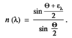
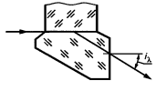

# ColoredOpticalGlassesBasedOnColloidalDyes
## Содержание
[Бесцветные оптические стекла	3](#_toc134743602)

[Цветные оптические стекла	18](#_toc134743603)

[Список литературы	19](#_toc134743604)

# **Бесцветные оптические стекла**
По результатам измерений для образца оптического бесцветного стекла получены следующие значения показателя преломления и дисперсии (см. таблицу): 

|Вариант|Показатель преломления ne|Средняя дисперсия (nF-nc)|
| - | - | - |
|7|1\.6744|0\.01435|

В соответствии с ГОСТ  3514-94 данным параметрам соответствует бесцветное оптическое стекло марки БФ16\*. Тип данного стекла называется “баритовые флинты”.

Флинт-тип бесцветных оптических стёкол, отличающихся малыми (менее 50) значениями коэффициента средней дисперсии Состав бесцветного стекла, относящегося к баритовым флинтам, может включать около 70-80% оксида кремния (SiO2), 10-15% оксида бария (BaO) и небольшие количества других оксидов, таких как оксид алюминия (Al2O3) и оксид кальция (CaO). Точный состав может варьироваться в зависимости от производителя и конкретного применения стекла.** К баритовым флинтам относятся стекла, показатель преломления которых от 1.52 до 1.70, а коэффициент дисперсии от 56 до 31. Они обладают высокой плотностью и преломляют свет сильнее, чем обычные стекла. К таким стеклам относятся, например, баритовые крошечные шарики, которые добавляют в стекло для улучшения его оптических свойств. Также баритовые флинты могут использоваться в качестве защитных стекол, например, в рентгеновских аппаратах, так как они обладают высокой плотностью и способны поглощать рентгеновское излучение.
## **Оптические свойства стекла:**
Преломление света — так в науке называют изменение направления светового луча при его прохождении через границу двух прозрачных сред. Величина, показывающая преломление света стекла, всегда больше единицы.

Отражение света — это возвращение светового луча при его падении на поверхность двух сред, имеющих различные показатели преломления.

Дисперсия света — разложение светового луча в спектр при его преломлении. Величина дисперсии света стекла прямо зависит от химического состава материала. Наличие в 

стекломассе тяжелых оксидов увеличивает показатель дисперсии. Именно этим свойством и объясняется явление так называемой игры света в хрустальных изделиях.

Поглощением света** определяют способность той или иной среды уменьшать интенсивность прохождения светового луча. Показатель поглощения света стекол невысок. Он увеличивается лишь при изготовлении стекла с применением различных красителей, а также особых способов обработки готовых изделий.

Рассеяние света — это отклонение световых лучей в различных направлениях. Показатель рассеяния света зависит от качества поверхности стекла. Так, проходя сквозь шероховатую поверхность, луч частично рассеивается, и потому такое стекло выглядит полупрозрачным. Это свойство, как правило, используют при изготовлении стеклянных абажуров для ламп и плафонов для светильников.

**Технологические свойства стекла:**

Вязкость - свойство пластичных материалов оказывать сопротивление перемещению одной их части относительно другой в результате возникновения между ними сил внутреннего трения. Она характеризуется коэффициентом внутреннего трения и измеряется в пуазах П (Па·с). Важнейшая технологическая характеристика, оказывающая большое влияние на параметры процесса варки стекла, формирования изделий, их отжига и закалки.

Поверхностное натяжение - работа, необходимая для сокращения площади поверхности жидкости на 1 см2.Поверхностное натяжение численно равно силе, действующей в плоскости касательной к поверхности жидкости и стремящейся сократить эту поверхность на единицу длины контура, ограничивающего данную поверхность. Поверхностное натяжение стекломассы составляет 0,25…0,38 Н/м.

Кристаллизация - способность атомной структуры вещества при переходе из жидкого состояние в твердое образовывать кристаллическую решетку. При получении обычных стекол это свойство нежелательно, так как закристаллизованное стекло обычно является непрозрачным и камнеподобным. 

Хрупкость — механическое свойство тел разрушаться под действием внешних сил. 

Величина хрупкости стекла в основном зависит не от химического состава образующих его компонентов, а в большей степени от однородности стекломассы (входящие в его состав компоненты должны быть беспримесными, чистыми) и толщины стенок стеклоизделия.

Флинты имеют маленькое значение дисперсии, но высокий показатель преломления. Обычно в класс флинтов относят стекла с содержанием свинца.

**Способы определения показателя преломления и средней дисперсии**

Существует несколько способов определения показателя преломления и средней дисперсии материала.

Метод измерения показателя преломления следует выбирать в зависимости от предельной погрешности измерений, приведенной в приложении 1, технико-экономической целесообразности выполнения требований к изготовлению образца для измерений, установленных для каждого метода. 

В случае необходимости проведения измерений показателей преломления и дисперсий с повышенной точностью требования к качеству измеряемых образцов, к средствам и условиям измерения должны устанавливаться в зависимости от конкретного объекта и цели измерения, с учетом особенностей используемого прибора и заданной погрешности.

1\. Гониометрические методы включают:

\- метод наименьшего отклонения; 

\- метод автоколлимации. 

2\. Рефрактометрические методы включают:

\- метод измерения на рефрактометре Пульфриха; 

\- метод измерения на V-рефрактометре; 

\- метод измерения на рефрактометре Аббе; 

\- метод измерения на компенсационном рефрактометре; 

\- интерференционный сравнительный метод измерения (метод Обреимова)

1\.МЕТОД НАИМЕНЬШЕГО ОТКЛОНЕНИЯ ПРИ ИЗМЕРЕНИИ НА ГОНИОМЕТРЕ

Метод наименьшего отклонения основан на измерении преломляющего угла θ образца 

в форме призмы с главным сечением\* в виде равнобедренного треугольника и угла 

наименьшего отклонения луча с длиной волны λ, проходящего в призме параллельно ее основанию (рис. 1).

                                                    

Показатель преломления (n(λ)) рассчитывают по формуле:

`                                                `

Требования к отбору образцов:

1. Отбор образцов следует проводить по технической документации, утвержденной в установленном порядке.
1. Образец оптического материала должен иметь форму трехгранной равнобедренной призмы с преломляющим углом θ, соответствующим требованиям формулы

`                                               `

1. Длина рабочих сторон АВ и ВС главного сечения образца должна обеспечивать требование к предельному углу разрешения зрительной трубы. Размеры рабочей преломляющей грани образца должны быть не менее 30 х 50 мм
1. Допуск плоскостности рабочих граней образца стекла должен быть не более 0,25 интерференционной полосы, образца кристалла — не более 0,5 интерференционной полосы. Угол между рабочими гранями и опорной плоскостью, параллельной главному сечению призмы, должен быть 90° ± 1'. 
1. Поверхности рабочих граней образца, заключающие преломляющий угол θ, должны быть отполированы. Параметр шероховатости R7 < 0,050 мкм — по ГОСТ 2789. 
1. В рабочем объеме образца не должно быть скоплений пузырей и включений. Требования к качеству материала — по ГОСТ 23136: 
- оптическая однородность — 1-й категории; 
- бессвильность (категория и класс) — 1А; 
- двулучепреломленне — 2-й категории. 
1. Поверхности рабочих граней образца не должны иметь царапин, точек, участков с недополировкой, а также налетов, пятен, пленок и других следов разрушения поверхностей. 
1. Коэффициент пропускания τ (λ) образна должен быть не менее 0,30.

Требования к средствам измерений:

1. Гониометры и гониометры-спектрометры, используемые для измерения показателя преломления, должны соответствовать требованиям табл. 1.

1. Источник излучения должен обеспечивать работу в области от 400 до 700 нм. В качестве источника излучения следует применять газоразрядные лампы с наполнителями: гелием, кадмием, натрием, ртутью, водородом. 
1. Для контроля рабочих условий следует применять: 

\- термометр по ГОСТ 28498 с ценой деления не более 0,1 °С; 

\- барометр с ценой деления не более 1 кПа; 

\- гигрометр с ценой деления не более 5 %.

2\.МЕТОД АВТОКОЛЛИМАЦИИ ПРИ ИЗМЕРЕНИИ НА ГОНИОМЕТРАХ

Метод автоколлимации основан на измерении преломляющего угла θ образца в форме 

призмы с главным сечением в виде прямоугольного треугольника и автоколлимационного угла падения (равного углу выхода) 4 луча с длиной волны к, проходящего в призме параллельно ее основанию и перпендикулярно к отражающей грани (рис. 2)

`                                                      `      

Показатель преломления (n(λ)) рассчитывают по формуле: nλ=siniksinθ

Требования к отбору образцов:

1. Отбор образцов следует проводить по технической документации, утвержденной в установленном порядке.
1. Образец оптического материала должен иметь форму трехгранной прямоугольной призмы с преломляющим углом θ, соответствующим требованиям формулы

`                                                `θ=arcsin1nλ-(6-3.5+1.5)

1. Длина рабочих граней главного сечения образца должна обеспечивать требования к предельному углу разрешения зрительной трубы (коллиматора). Размеры рабочей преломляющей грани образца должны быть не менее 30 х 50 мм. 
1. Допуск плоскостности рабочих граней образца стекла для измерения на автоматизированном гониометре-спектрометре — 0.2 интерференционной полосы, образца кристалла — 0.5 интерференционной полосы. Допуск плоскостности рабочих граней образца бескислородных стекол для измерения па инфракрасном гониометре — две интерференционные полосы. 
1. На поверхности рабочей отражающей грани образца должно быть нанесено зеркальное покрытие, обеспечивающее спектральный коэффициент отражения не менее 0.90. 
1. В рабочем объеме образца не должно быть скоплений пузырей и включений. Требования к качеству материала — по ГОСТ 23136:
- оптическая однородность — 1-й категории; 
- бессвильность (категория и класс) — 1А; 
- двулучепреломленне — 2-й категории. 

Поверхности рабочих граней образца не должны иметь царапин, точек, участков с недополировкой, а также налетов, пятен, пленок и других следов разрушения поверхностей. 

Коэффициент пропускания τ (λ) образна должен быть не менее 0,30.

Требования к средствам измерений:

1. Гониометры и гониометры-спектрометры, используемые для измерения показателя преломления, должны соответствовать требованиям табл. 2.

1. Требования к источнику и приемнику излучения должны устанавливаться в совокупности с требованиями к гониометру в целом в зависимости от спектральной области измерения показателя преломления. 
1. Для контроля рабочих условий следует применять: 

\- термометр по ГОСТ 28498 с ценой деления не более 0,1 °С;

` `- барометр с ценой деления не более 1 кПа; 

\- гигрометр с ценой деления не более 5 %.

3\.МЕТОД ИЗМЕРЕНИЯ НА РЕФРАКТОМЕТРЕ ПУЛЬФРИХА

Метод основан на явлении полного внутреннего отражения при прохождении луча из среды с большим показателем преломления в среду с меньшим показателем. Для определения показателя преломления измеряют предельный угол iλ выхода луча из измерительной призмы (рис 3).

`                                                         `

Показатель преломления (n(λ)) для преломляющего угла призмы, равного 90\*, рассчитывают по формуле: nλ=Nλ2-siniλ2

где Nλ — показатель преломления измерительной призмы для длины волны λ.

Требования к отбору образцов:

1. Отбор образцов следует проводить по технической документации, утвержденной в установленном порядке. 
1. Образец должен иметь форму прямоугольной пластины размерами не менее 15х15х 4 мм.
1. Угол между рабочими гранями образца должен быть равен 90\* ± 10'. Фаски и выколки на ребре прямого угла не допускаются.
1. Допуск плоскостности рабочих поверхностей образца — две интерференционные полосы на 1 см с местными отклонениями до 0,5 интерференционной полосы. 
1. Поверхности рабочих граней должны быть отполированы. Параметр шероховатости R≤0,050 мкм - по ГОСТ 2789. 
1. В рабочем объеме образца не должно быть скоплений пузырей и включений. Требования к качеству материала — по ГОСТ 23136: 

   - бессвильность — 2-й категории;

   - двулучепреломление — 3-й категории.

Требования к средствам измерений:

1. Рефрактометр Пульфриха, используемый для измерений, должен соответствовать требованиям табл. 3

   

1. Иммерсионная жидкость, используемая при измерении, должна иметь показатель преломления больше показателя преломления образца, но не больше показателя преломления измерительной призмы.
1. Источник излучения должен обеспечивать работу в области от 400 до 700 нм. В качестве источника излучения следует применять газоразрядные лампы с наполнителями: гелием, кадмием, натрием, ртутью, водородом.

4\.МЕТОД ИЗМЕРЕНИЯ НА V-РЕФРАКГОМЕТРЕ

Метод основан на измерении угла отклонения  луча, проходящего через систему призм из испытуемого материала и измерительной призмы (рис. 4).

`                                                        `

Показатель преломления (n(λ)) рассчитывают по формуле:

`                                `

Требования к отбору образцов:

1. Отбор образцов следует проводить по технической документации, утвержденной в установленном порядке.
1. Образец должен иметь форму прямоугольного параллелепипеда со стороной сечения не менее 17 мм. Толщина образца должна быть от 4 до 20 мм в зависимости от прозрачности материала и интенсивности излучения источника.
1. Угол между рабочими гранями образца должен быть 90° ± 1’.
1. Допуск плоскостности рабочих поверхностей образца — три интерференционные полосы с местным отклонением до 0,5 интерференционной полосы
1. Поверхности образца должны быть отшлифованы (параметр шероховатости Ra < 0,63 мкм — по ГОСТ 2789) или отполированы (параметр шероховатости Rz < 0,050 мкм — по ГОСТ 2789).
1. В рабочем объеме образца не должно быть скоплений пузырей и включений. 

Требования к качеству материала — по ГОСТ 23136:

\- бессвильность — 2-й категории; 

\- двулучепреломление — 3-й категории.

Требования к средствам измерений:

1. V-рефрактометр, используемый для измерений, должен соответствовать требованиям табл. 4

Таблица 4

1. Иммерсионная жидкость, используемая при измерении, должна иметь показатель преломления, отличающийся от показателя преломления материала не более чем на 0,02. 
1. Источник излучения должен обеспечивать работу в области от 400 до 700 нм. В качестве источника излучения следует применять газоразрядные лампы с наполнителями: гелием, кадмием, натрием, ртутью, водородом.
1. Для контроля рабочих условий следует применять: 

\- термометр по ГОСТ 28498 с ценой деления не более 0,1 °С; 

\- барометр с ценой деления не более 1 кПа; 

\- гигрометр с ценой деления не более 5 %.

5\. МЕТОД ИЗМЕРЕНИЯ НА РЕФРАКТОМЕТРЕ АББЕ

Метод основан на явлении полного внутреннего отражения и определении угла выхода луча, проходящего из образца в измерительную призму, обладающую по сравнению с образцом большим показателем преломления (рис. 5)

                                             

Показатель преломления (n(λ)) для длины волны λ при отсутствии шкалы показателей преломления рассчитывают по формуле: n(λ) = sinφNλ2-sinελ2+cosφ\*sinελ

где ϕ — угол преломления измерительной призмы. 

Nλ — показатель преломления измерительной призмы, 

ελ — предельный угол выхода луча.

Требования к отбору образцов:

1. Отбор образцов следует проводить по технической документации, утвержденной в установленном порядке. 
1. Образец должен иметь форму плоскопараллельной пластины с углом между рабочими гранями 90\* ± 10'. 
1. Допуск плоскостности рабочих поверхностей образца — три интерференционные полосы с местными отклонениями до одной интерференционной полосы

Требования к средствам измерений: 

1. Рефрактометр Аббе, используемый для измерений, должен соответствовать требованиям табл. 5.

1. В качестве источника излучения для прибора со шкалой показателей преломления и компенсатором применяют лампу накаливания или спектральную лампу с фильтром, выделяющим заданную длину волны или дневной свет.
1. Для контроля рабочих условий следует применять: 

\- термометр по ГОСТ 28498 с ценой деления не более 0,1 °С; 

\- барометр с ценой деления не более 1 кПа; 

\- гигрометр с ценой деления не более 5 %.

6\. МЕТОД ИЗМЕРЕНИЯ НА КОМПЕНСАЦИОННОМ РЕФРАКТОМЕТРЕ

Дифференциальный метод измерения показателя преломления основан на явлении интерференции дифрагированных лучей вдоль границы соприкосновения двух материалов с разными показателями преломления. Разность хода лучей, возникающую на границе сравниваемых образцов, измеряют при помощи компенсатора, состоящего из подвижного и неподвижного клиньев, в котором она может меняться пропорционально перемещению клина.

Разность показателей преломления сравниваемых образцов рассчитывают по формуле

`                                                         `

где  C — постоянная компенсатора, т.е. разность хода лучей с длиной волны λ, вносимая 

компенсатором, соответствующая цене деления шкалы, нм/мм; т{) — отсчет по шкале компенсатора при разности хода лучей, равной нулю, мм; т — отсчет, соответствующий компенсированной разности хода лучей для сравниваемых образцов, мм; s — толщина сравниваемых образцов в направлении прохождения лучей, мм.

Требования к отбору образцов:

1. Отбор образцов следует проводить по технической документации, утвержденной в установленном порядке. 
1. Сравниваемые образцы должны иметь форму прямоугольных параллелепипедов размерами не менее 10 х 10 х 10 мм. Рекомендуемые размеры сравниваемого образца 20 х 10 х 10 мм, образца, относительно которого ведется сравнение, — 14 х 10 х 10 мм.
1. Сравниваемые образцы должны быть склеены между собой наибольшими гранями, предварительно отшлифованными. Параметр шероховатости Ra < 0,63 мкм — по ГОСТ 2789. Толщина склейки должна быть не более 0,2 мм. Поверхности рабочих граней склеенных образцов, перпендикулярных к плоскости склейки, следует обрабатывать совместно. Допуск перпендикулярности плоскости склейки к рабочим граням — 10'.
1. Допуск плоскостности рабочих поверхностей склеенных образцов — три интерференционные полосы при местном отклонении до 0,5 интерференционной полосы.
1. Поверхности рабочих граней должны быть отполированы. Параметр шероховатости Rz < 0,050 мкм — по ГОСТ 2789.
1. Допуск параллельности рабочих граней склеенных образцов вблизи плоскости склейки — 0,01 мм
1. В рабочем объеме образцов вблизи плоскости склейки не должно быть скоплений пузырей и включений. 

Требования к качеству материала — по ГОСТ 23136:

` `- бессвильность — 2-й категории; 

\- двулучепреломление — 3-й категории; 

\- разность дисперсий склеенных образцов должна быть не более 5 • 10 5

Требования к средствам измерений:

1. Компенсационный рефрактометр для измерения разности показателей преломления должен соответствовать требованиям табл. 6

Таблица 6

1. В качестве источника излучения следует применять спектральную лампу с фильтрами, выделяющими выбранную длину волны, и лампу накаливания.
1. Накладные стекла, используемые при контроле образцов со шлифованными рабочими поверхностями, должны иметь форму прямоугольных пластин размерами 20 х 20 х 2 мм. Допуск плоскостности рабочих поверхностей — пять интерференционных полос.
1. Иммерсионная жидкость, используемая при измерении, должна иметь показатель преломления, отличающийся от показателя преломления образца, относительно которого ведется сравнение, более чем на 2 • 10^(-3)
1. Для контроля рабочих условий следует применять: 

   - термометр по ГОСТ 28498 с ценой деления не более 0,1 °С; 

   - барометр с ценой деления не более 1 кПа; 

   - гигрометр с ценой деления не более 5 %.

7\.** ИНТЕРФЕРЕНЦИОННЫЙ СРАВНИТЕЛЬНЫЙ МЕТОД ИЗМЕРЕНИЯ

(МЕТОД ОБРЕИМОВА)

Метод основан на явлении исчезновения видимости границ оптического материала, погруженного в иммерсионную жидкость, при длине волны монохроматического излучения, для которой показатель преломления жидкости и материала равны. 

Метод сводится к измерению разности показателей преломления, измеряемого образна (далее — пробы) и контрольного образца (далее — образца), погруженных в иммерсионную жидкость. 

При помощи монохроматора определяют длину волны λ0, при которой исчезает видимость границ образна, а затем длину волны λ. при которой исчезает видимость границ пробы (рис. 7).

`                                                        `

Разность показателей преломления пробы и образца определяют по формуле: 

∆nλ=nпр-nоб-N\*λs\*10-6

где s — толщина образца, мм; 

nоб — показатель преломления образца; 

nпр — показатель преломления пробы;

N — число интерференционных полос, прошедших через рабочее ребро образца при переходе от длины волны λ0, к длине волны λ. 

Показатель преломления пробы оптического материала рассчитывают по формуле: 

nпр=nоб+∆nλ

Требования к отбору образцов:

1. Проба может быть любой формы. Рабочая грань должна иметь ширину от 0,5 до 3,0 мм или двугранный угол, ограниченный прозрачными гранями. 
1. В пробе на расстоянии не менее 2 мм от края рабочей грани не должно быть свилей, видимых невооруженным глазом, скоплений пузырей и включений.

Требования к средствам измерений:

1. Сменными источниками излучения служат лампы накаливания и газоразрядные лампы, обеспечивающие работу в видимой области спектра. 
1. Монохроматор должен соответствовать следующим требованиям:

диапазон длин волн,  нм .....................................................................................от 380 до760 

относительное отверстие объектива, не менее................................................. 1:6 

разрешающая способность, нм, не менее.......................................................... 0.4

**Вычисление коэффициента дисперсии**

Коэффициент дисперсии - это отношение разности между наибольшим и наименьшим значением некоторой величины к ее среднему значению. Он показывает, насколько сильно значения величины разбросаны относительно ее среднего значения.

Для вычисления коэффициента дисперсии необходимо выполнить следующие шаги: 

1\. Вычислить среднее значение величины. Для этого необходимо сложить все значения величины и разделить полученную сумму на их количество. 

2\. Найти наибольшее и наименьшее значение величины. 

3\. Вычислить разность между наибольшим и наименьшим значением. 

4. Разность между наибольшим и наименьшим значением разделить на среднее значение величины. 

Формула для вычисления коэффициента дисперсии имеет вид:

`                                                 `Ve=ne-1 nF`-nC`,                            

где ne, nF ', nC ' - показатели преломления стекла для спектральных линий e, F`,C`.

В зависимости от показателя преломления ne и коэффициента дисперсии νe строится диаграмма Аббе. Стекла каждого типа располагаются на поле диаграммы на строго ограниченных участках, за исключением стекол типа ОК и ОФ, которые могут находиться на разных участках поля диаграммы.
# **Цветные оптические стекла**
Необходимо выбрать цветное оптическое стекло по ГОСТ 9411-91 для использования в качестве светофильтра, имеющего максимум пропускания на длине волны, указанной в таблице:

|вариант|Длина волны λ, нм|
| - | - |
|7|600|

В соответствии с ГОСТ 9411-91 данному показателю длины волны соответствуют стёкла ЖЗС19 и ЖС20.

Ниже приведены спектральные кривые зависимости коэффициента внутреннего пропускания τ(λ) от длины волны для указаных цветных оптических стекол.

                                                        ![ref1]                

`                                                             `

`                              `ЖС20                ![ref1] 

`                                                             `

По данным кривым можно заметить, что стекло ЖС20 имеет больший коэффициент пропускания, чем  ЖЗС19. Стекла  ЖС20 и ЖЗС19 обладают наибольшим пропусканием не только на длине волны 600нм, но и на других длинах волн, поэтому можно сделать вывод, что наиболее подходящим стеклом для использования в качестве светофильтра, имеющего максимум пропускания на длине волны 400 нм, является стекло ЖС20.

Основные параметры, по которым нормируются цветные стекла:

1. показателю поглощения  а(λ) слоя стекла толщиной 1 мм при длинах волн, заданных для стекла каждой марки (стекла, окрашенные молекулярными красителями);
1. показателю поглощения  а(λ0), длине волны λтр и крутизне кривой оптической плотности Кр слоя стекла толщиной, равной толщине светофильтра (стекла, окрашенные сульфоселенидами или сульфидами металлов);
1. Длине волны 
1. Крутизне кривой оптической плотности слоя стекла толщиной, равной толщине светофильтра
1. показателю поглощения аср, среднему отклонению Оср и наибольшему отклонению Оmax слоя толщиной 1 мм (стекла марок НС1-НС12);
1. Двулучепреломлению
1. Бессвильности 
1. Пузырности

Где а(λ0) - показатель поглощения в области наименьшего поглощения, λтр - длина волны, характеризующая границу пропускания, при которой оптическая плотность стекла превышает на 0,3 оптическую плотность стекла той же толщины при длине волны  λ0 или коэффициент внутреннего пропускания равен 0,50, Кр  - крутизна кривой оптической плотности стекла, аср - среднее арифметическое абсолютных значений показателя поглощения а(λ), Оср - среднее арифметическое абсолютных значений отклонения показателя поглощения а(λ) от измеренного значения аср, выраженное в процентах от аср, Оmax - наибольшее из абсолютных значений отклонения а(λ) от аср, выраженное в процентах. 
## Получение желтого стекла.
Изобретение относится к области технологии силикатов и касается составов стекла, которое может быть использовано для изготовления световых рассеивателей, витражей, изделий декоративно-художественного назначения, сортовой посуды. Технический результат состоит в повышении показателя преломления света стекла. Стекло содержит, мас.%: SiO2 69,5-74,5; CaO 7,0-9,0; Na2O 9,0-13,0; K2O 3,0-4,0; CeO2 1,0-2,0; Fe3O4 0,2-0,3; Sb2O3 0,2-0,3; BaO 3,0-4,0. 1 

Задача решается тем, что в состав стекла, содержащего SiO2, CaO, Na2O, K2O, CeO2, Fe3O4, дополнительно вводят Sb2O3 и BaO, при следующем соотношении компонентов, мас.%: SiO2 69,5-74,5; CaO 7,0-9,0; Na2O 9,0-13,0; K2O 3,0-4,0; CeO2 1,0-2,0; Fe3O4 0,2-0,3; Sb2O3 0,2-0,3; BaO 3,0-4,0.

Интенсивность окраски стекла зависит от нескольких факторов:

1\. Концентрация красителя в стекле. Чем выше концентрация красителя, тем более насыщенный и интенсивный цвет;

2\. Толщина и прозрачность стекла. Более толстое и менее прозрачное стекло может снижать яркость и насыщенность цвета;

3\. Тип и концентрация других добавок в стекле, например, оксида железа, может влиять на цвет кобальтовых и медных красителей;

4\. Температура во время процесса изготовления стекла. Увеличение температуры может приводить к большей диффузии красителей в стекле, увеличивая насыщенность цвета;

5\. Время, затраченное на процесс окраски. Более длительный процесс окраски может дать более насыщенный цвет;

6\. Воздействие солнечного света и ультрафиолетовых лучей. Это может привести к выцветанию и изменению цвета стекла со временем.

# Список литературы
1. ГОСТ 28869-90 https://meganorm.ru/Data2/1/4294825/4294825852.pdf
1. ГОСТ 3514-94 https://meganorm.ru/Data2/1/4294824/4294824498.pdf
1. ГОСТ 9411-91 https://docs.cntd.ru/document/1200023782
1. https://files.stroyinf.ru/Data2/1/4294820/4294820910.pdf 
1. <https://zakonbase.ru/content/part/490053?print=1>
1. <https://www.remontiruemlegko.ru/steklo-osnovnye-svojstva-i-harakteristiki.html>
1. <http://www.bibliotekar.ru/6-steklyannye/4.htm>
1. https://findpatent.ru/patent/232/2326062.html

[ref1]: Aspose.Words.1f98cfaa-55c4-4314-b0a6-00af00cda4cd.029.png
